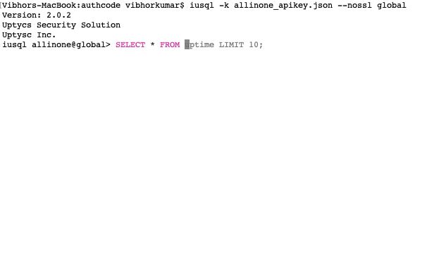

# usql
A command-line client for Uptycs that has auto-completion and syntax highlighting.

## Installation

If you already know how to install python packages, then you can install it via pip:

You might need sudo on linux.

```
$ pip install -U usql
```

## Download the API key from uptyc. 

Following are the steps for downloading API key:
 1. Connect to you tenant using your username and password. Uptycs URL example: https://<tenant>.uptycs.io
 2. Got to configuration -> Users
 3. Go to your username click on Edit 
 4. Create and Dowload "User API key"

## Usage
```
$ usql --help
Usage: usql [OPTIONS] [DATABASE]

  A Uptycs terminal client with auto-completion and syntax highlighting.

  Examples:
    - usql -k <uptycs keyfile> database

      where database = [global|realtime|audit]

Options:
  -V, --version           Output usql's version.
  -D, --database TEXT     Database to use.
  -R, --prompt TEXT       Prompt format (Default: "\d> ").
  -l, --logfile FILENAME  Log every query and its results to a file.
  --usqlrc PATH          Location of usqlrc file.
  --auto-vertical-output  Automatically switch to vertical output mode if the
                          result is wider than the terminal width.
  -t, --table             Display batch output in table format.
  --csv                   Display batch output in CSV format.
  --warn / --no-warn      Warn before running a destructive query.
  -e, --execute TEXT      Execute command and quit.
  -k, --keyfile TEXT      Uptycs Key file.
  --domainsuffix TEXT     Uptycs Domain Suffix like .uptycs.io
  --nossl                 do not verify ssl certificate
  --help                  Show this message and exit.
```

A config file is automatically created at `~/.config/usql/config` at first launch. See the file itself for a description of all available options.

## Connect and execute a query
```
vibhors-macbook:authcode vibhorkumar$  usql  -k allinone_apikey.json global
Version: 2.0.2
Uptycs Security Solution
Uptysc Inc.
usql allinone@global> SELECT upt_hostname, upt_time, days, hours, minutes, seconds from uptime limit 10;                                                                                                                  
+--------------------------------------------+-------------------------+------+-------+---------+---------+
| upt_hostname                               | upt_time                | days | hours | minutes | seconds |
+--------------------------------------------+-------------------------+------+-------+---------+---------+
| cenos7.c.perfect-entry-149521.internal     | 2019-04-09 22:55:08.000 | 54   | 9     | 29      | 15      |
| cenos7.c.perfect-entry-149521.internal     | 2019-04-09 22:55:08.000 | 54   | 10    | 31      | 26      |
| allinone                                   | 2019-04-09 16:58:50.000 | 55   | 16    | 58      | 0       |
| allinone                                   | 2019-04-09 16:58:50.000 | 55   | 17    | 56      | 33      |
| cenos7.c.perfect-entry-149521.internal     | 2019-04-10 10:18:54.000 | 54   | 20    | 53      | 0       |
| cenos7.c.perfect-entry-149521.internal     | 2019-04-10 10:18:54.000 | 54   | 21    | 55      | 11      |
| ip-172-31-84-85.ec2.internal               | 2019-04-10 09:54:35.000 | 52   | 12    | 49      | 42      |
| ip-172-31-84-85.ec2.internal               | 2019-04-10 09:54:35.000 | 52   | 13    | 55      | 42      |
| instance-4.c.perfect-entry-149521.internal | 2019-04-10 09:43:04.000 | 54   | 20    | 20      | 30      |
| instance-4.c.perfect-entry-149521.internal | 2019-04-10 09:43:04.000 | 54   | 21    | 20      | 42      |
+--------------------------------------------+-------------------------+------+-------+---------+---------+  
```

## Other shortcuts and command line options
```
usql allinone@global> \?                                                                                                                                                                                                  
+------------+----------------------------+------------------------------------------------------------+
| Command    | Shortcut                   | Description                                                |
+------------+----------------------------+------------------------------------------------------------+
| .databases | .databases                 | List databases.                                            |
| .exit      | \q                         | Exit.                                                      |
| .mode      | \T                         | Change the table format used to output results.            |
| .once      | \o [-o] filename           | Append next result to an output file (overwrite using -o). |
| .open      | .open                      | Change to a new database.                                  |
| .schema    | .schema[+] [table]         | The complete schema for the database or a single table     |
| .status    | \s                         | Show current settings.                                     |
| .tables    | \dt[+] [table]             | List or describe tables.                                   |
| \G         | \G                         | Display current query results vertically.                  |
| \e         | \e                         | Edit command with editor (uses $EDITOR).                   |
| \f         | \f [name [args..]]         | List or execute favorite queries.                          |
| \fd        | \fd [name]                 | Delete a favorite query.                                   |
| \fs        | \fs name query             | Save a favorite query.                                     |
| help       | \?                         | Show this help.                                            |
| nopager    | \n                         | Disable pager, print to stdout.                            |
| notee      | notee                      | Stop writing results to an output file.                    |
| pager      | \P [command]               | Set PAGER. Print the query results via PAGER.              |
| prompt     | \R                         | Change prompt format.                                      |
| quit       | \q                         | Quit.                                                      |
| rehash     | \#                         | Refresh auto-completions.                                  |
| source     | \. filename                | Execute commands from file.                                |
| system     | system [command]           | Execute a system shell commmand.                           |
| tee        | tee [-o] filename          | Append all results to an output file (overwrite using -o). |
| watch      | watch [seconds] [-c] query | Executes the query every [seconds] seconds (by default 5). |
+------------+----------------------------+------------------------------------------------------------+
```


## Auto Completion

### Table


### Column


### Alias


### Autosuggestion



### FuzzyMatch


## Config File

usql ships with sane defaults. These defaults are defined in a configuration file located under ~/.config/usql/config.

The config file is created when usql is launched for the very first time. Updates to that file are NOT overwritten by subsequent launches of usql or updating the version of usql.
```
[main]

# Multi-line mode allows breaking up the sql statements into multiple lines. If
# this is set to True, then the end of the statements must have a semi-colon.
# If this is set to False then sql statements can't be split into multiple
# lines. End of line (return) is considered as the end of the statement.
multi_line = True

# Destructive warning mode will alert you before executing a sql statement
# that may cause harm to the database such as "drop table", "drop database"
# or "shutdown".
destructive_warning = True

# log_file location.
# In Unix/Linux: ~/.config/usql/log
# In Windows: %USERPROFILE%\AppData\Local\dbcli\usql\log
# %USERPROFILE% is typically C:\Users\{username}
log_file = default

# Default log level. Possible values: "CRITICAL", "ERROR", "WARNING", "INFO"
# and "DEBUG". "NONE" disables logging.
log_level = DEBUG

# Log every query and its results to a file. Enable this by uncommenting the
# line below.
# audit_log = ~/.usql-audit.log

# Default pager.
# By default '$PAGER' environment variable is used
# pager = less -SRXF

# Table format. Possible values:
# ascii, double, github, psql, plain, simple, grid, fancy_grid, pipe, orgtbl,
# rst, mediawiki, html, latex, latex_booktabs, textile, moinmoin, jira,
# vertical, tsv, csv.
# Recommended: ascii
table_format = ascii

# Syntax coloring style. Possible values (many support the "-dark" suffix):
# manni, igor, xcode, vim, autumn, vs, rrt, native, perldoc, borland, tango, emacs,
# friendly, monokai, paraiso, colorful, murphy, bw, pastie, paraiso, trac, default,
# fruity.
# Screenshots at http://mycli.net/syntax
syntax_style = xcode

# Keybindings: Possible values: emacs, vi.
# Emacs mode: Ctrl-A is home, Ctrl-E is end. All emacs keybindings are available in the REPL.
# When Vi mode is enabled you can use modal editing features offered by Vi in the REPL.
key_bindings = vi

# Enabling this option will show the suggestions in a wider menu. Thus more items are suggested.
wider_completion_menu = False

# usql prompt
# \U - domain or customer_name
# \t - tool name (usql)
# \D - The full current date
# \d - Database name
# \m - Minutes of the current time
# \n - Newline
# \P - AM/PM
# \R - The current time, in 24-hour military time (0-23)
# \r - The current time, standard 12-hour time (1-12)
# \s - Seconds of the current time
prompt = "\t \U@\d> "
prompt_continuation = " -> "

# Skip intro info on startup and outro info on exit
less_chatty = False

# Use alias from --login-path instead of host name in prompt
login_path_as_host = False

# Cause result sets to be displayed vertically if they are too wide for the current window,
# and using normal tabular format otherwise. (This applies to statements terminated by ; or \G.)
auto_vertical_output = False

# keyword casing preference. Possible values "lower", "upper", "auto"
keyword_casing = auto

# disabled pager on startup
enable_pager = True
[colors]
completion-menu.completion.current = "bg:#ffffff #000000"
completion-menu.completion = "bg:#008888 #ffffff"
completion-menu.meta.completion.current = "bg:#44aaaa #000000"
completion-menu.meta.completion = "bg:#448888 #ffffff"
completion-menu.multi-column-meta = "bg:#aaffff #000000"
scrollbar.arrow = "bg:#003333"
scrollbar = "bg:#00aaaa"
selected = "#ffffff bg:#6666aa"
search = "#ffffff bg:#4444aa"
search.current = "#ffffff bg:#44aa44"
bottom-toolbar = "bg:#222222 #aaaaaa"
bottom-toolbar.off = "bg:#222222 #888888"
bottom-toolbar.on = "bg:#222222 #ffffff"
search-toolbar = noinherit bold
search-toolbar.text = nobold
system-toolbar = noinherit bold
arg-toolbar = noinherit bold
arg-toolbar.text = nobold
bottom-toolbar.transaction.valid = "bg:#222222 #00ff5f bold"
bottom-toolbar.transaction.failed = "bg:#222222 #ff005f bold"

# style classes for colored table output
output.header = "#00ff5f bold"
output.odd-row = ""
output.even-row = ""
[favorite_queries]
query_check = "select host_name, os from upt_assets"
```

## Favorite Queries

Favorite Queries are a way to save frequently used queries with a short name.

```
\f - list all favorite queries.

\f <name> - Invoke a favorite query by its name.

\fs <name> <query> - Save a new favorite query called ‘name’.

\fd <name> - Delete an existing favorite query by its name.

Examples:
usql allinone@global> \f                                                                                                                                                                                                  
+-------------+--------------------------------------+
| Name        | Query                                |
+-------------+--------------------------------------+
| query_check | select host_name, os from upt_assets |
+-------------+--------------------------------------+
Time: 0.005s

No favorite query: 
Time: 0.000s

 # Save a new favorite query.
    
usql allinone@global> \fs limit_hosts SELECT host_name, os FROM upt_assets LIMIT $1  
                   ->                                                                                                                                                                                                      
Saved.
Time: 0.004s

# Run a favorite query.

usql allinone@global> \f limit_hosts 10                                                                                                                                                                                   
> SELECT host_name, os FROM upt_assets LIMIT 10
+--------------------------------------------+------------------+
| host_name                                  | os               |
+--------------------------------------------+------------------+
| vibhors-macbook.local                      | Mac OS X         |
| cenos7.c.perfect-entry-149521.internal     | CentOS Linux     |
| allinone                                   | Ubuntu           |
| instance-4.c.perfect-entry-149521.internal | CentOS           |
| ip-172-31-84-85.ec2.internal               | Amazon Linux AMI |
+--------------------------------------------+------------------+
Time: 1.456s
usql allinone@global> \f limit_hosts 1                                                                                                                                                                                    
> SELECT host_name, os FROM upt_assets LIMIT 1
+-----------------------+----------+
| host_name             | os       |
+-----------------------+----------+
| vibhors-macbook.local | Mac OS X |
+-----------------------+----------+
Time: 1.840s

 # Delete a favorite query.
usql allinone@global> \fd limit_hosts
limit_hosts: Deleted
Time: 0.001s

Positional Parameters

Favorite queries support shell-style parameter substitution. Save your favorite query with parameters as placeholders (e.g. $1, $2, $3, etc.):

\fs user_by_name select * from users where name = '$1'
When you call a favorite query with parameters, just add the parameters after the query’s name. You can put quotes around arguments that include spaces.

\f user_by_name "Skelly McDermott"
```
